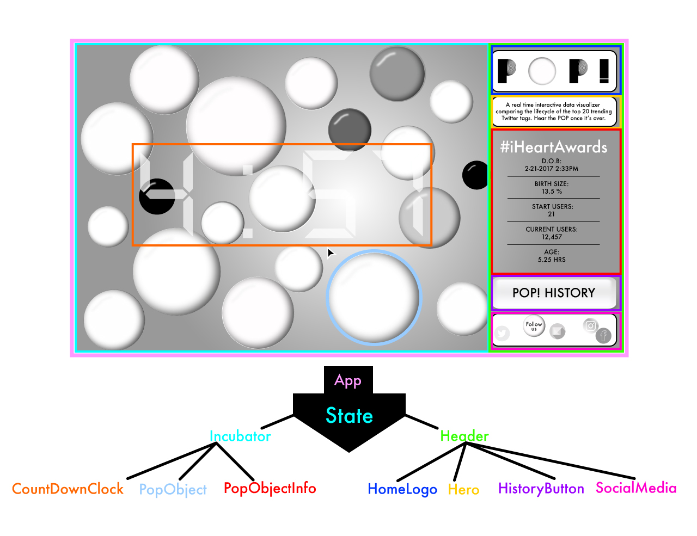

# P 🔴 P!

#### A real time interactive data visualizer comparing the lifecycle of the top 20 trending Twitter tags. Hear the POP once it's over.

#### by **Mikey Pinaud**

## Description
#### POP! is a real time interactive data visualizer comparing the lifecycle of the top 20 trending Twitter tags. Each tag will begin it’s Pop-cycle in the form of a black bubble floating amongst others within an incubator. We then start recording it’s Pop-file into our database. A Pop-file includes a tag name, start time and date, start percentage size, start number of Twitter users, how many current Twitter users tagging, and number of iterations in the incubator. It’s start percentage size will be based off comparison of one another by number of Twitter users currently using that tag. There will be a 5 minute countdown timer for this is when a user can hover on each individual bubble to see it’s current recorded Pop-file before the next iteration is called. A Pop-cycle’s color will be based off how many iterations it’s sat in the incubator.

#### Once an iteration is called and the tag is no longer within the current top 20 trend bracket, POP! The lifecycle is over. That Pop cycle’s POP! time and date will then be added to it’s Pop-file which then will finally be logged into a master database of all popped Pop-cycles. The user will then be able refer back to past POP!’s in the interactive master database. This data will include tag name, start date and time, start number of Twitter users, largest number of Twitter users, and bubble images including start percentage size, largest popularity size, iteration color with number of iterations, POP! size, date and time.

## Prototyping
### Desktop

### Component Legend

### Component Tree

### On Hover Example

### POP File History

## Minimum Viable Product Breakdown

* Meet the required endpoints to call from Twitter API for trend characteristics.
* Aggregate only the current top 20.
* Make API call every minute for iteration.
* Save, update and dynamically render Pop-file into DOM in real time for each iteration while using Moment.js to show start time, current time.
* Create and meet endpoints with Firebase and store collected Twitter data into Firebase.
* Create graphical UI to show compared trends and for past stored trends.
* Include POP! audio.
* Create interactive UI for user to see database of current or logged POP!.

## Minimum Viable Product Resources

* React
* Redux
* Jest
* JavaScript
* Moment.js
* Firebase
* CSS
* Twitter API
* D3.js

## Future Development Goals

* Call an additional API source to give a description/random fact of the tag and add it to the Pop-file database. (Like VH1 Pop-Up Video)
* User can sign in using their Twitter account, create a profile, and save current or Popped tags into their POP! profile.
* During sign in user can be notified once current stored POP eventually POP!’s.
* During sign in user can easily keep a POP alive by pressing a button that will append a Tweet form that will include the POP tag name an additional tag #POP!lifematters which will append into their Twitter feed.

## Future Development Tools

* MediaWiki API

#### Notes

* Create OAuth 2.0
  (Twitter offers applications the ability to issue authenticated requests on behalf of the application itself (as opposed to on behalf of a specific user). Twitter’s implementation is based on the Client Credentials Grant flow of the OAuth 2 specification. Note that OAuth 1.0a is still required to issue requests on behalf of users.)

* Glamorous
  (Researching Glamorous for CSS styling.)

## License

Copyright (c) 2018, Mikey Pinaud

Permission is hereby granted, free of charge, to any person obtaining a copy of this software and associated documentation files (the "Software"), to deal in the Software without restriction, including without limitation the rights to use, copy, modify, merge, publish, distribute, sublicense, and/or sell copies of the Software, and to permit persons to whom the Software is furnished to do so, subject to the following conditions:

The above copyright notice and this permission notice shall be included in all copies or substantial portions of the Software.

THE SOFTWARE IS PROVIDED "AS IS", WITHOUT WARRANTY OF ANY KIND, EXPRESS OR IMPLIED, INCLUDING BUT NOT LIMITED TO THE WARRANTIES OF MERCHANTABILITY, FITNESS FOR A PARTICULAR PURPOSE AND NONINFRINGEMENT. IN NO EVENT SHALL THE AUTHORS OR COPYRIGHT HOLDERS BE LIABLE FOR ANY CLAIM, DAMAGES OR OTHER LIABILITY, WHETHER IN AN ACTION OF CONTRACT, TORT OR OTHERWISE, ARISING FROM, OUT OF OR IN CONNECTION WITH THE SOFTWARE OR THE USE OR OTHER DEALINGS IN THE SOFTWARE.
